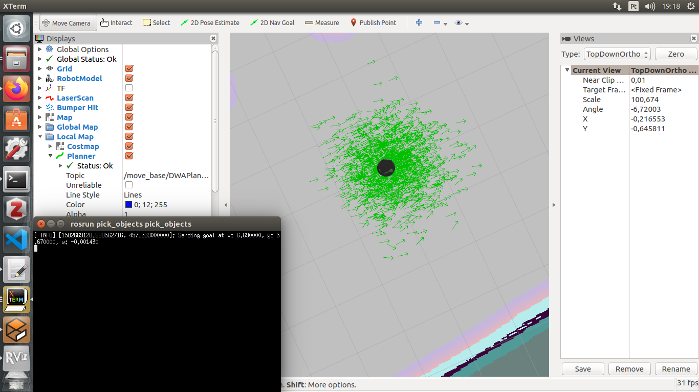
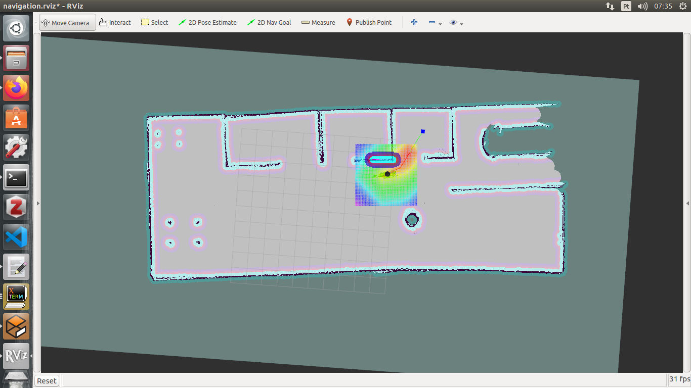
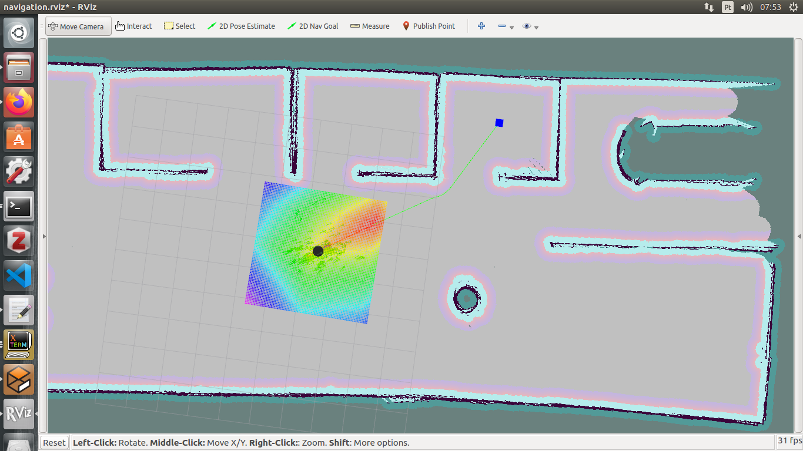
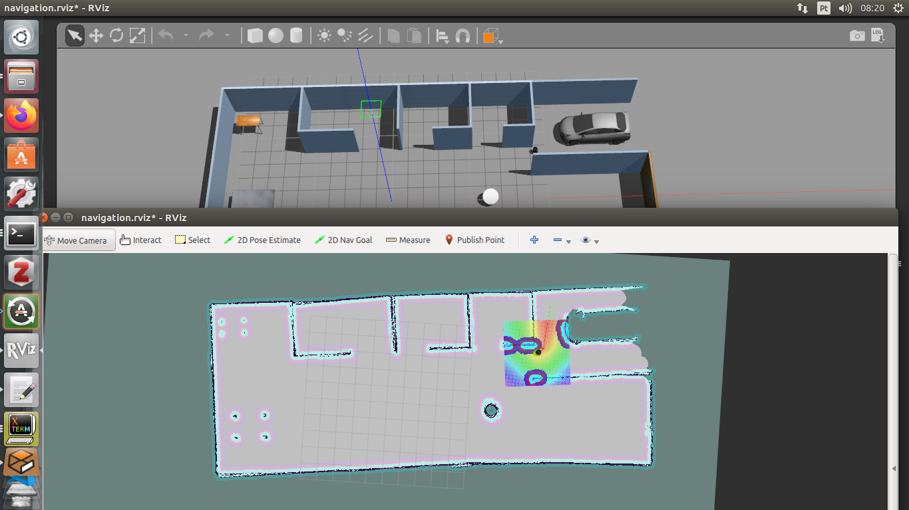
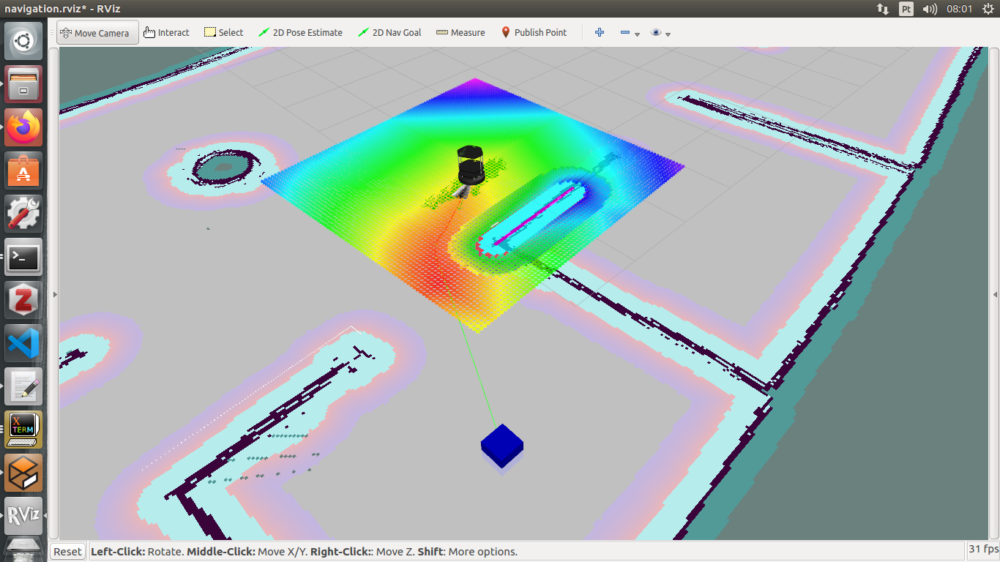

[](https://www.udacity.com/robotics)

# Udacity Home Service Robot 

This is the final project of the Robot Nanodegree from Udacity. The main goal is coding a Home Service Robot to pick up and delivery a package autonomously. 

For this project, it was necessary to perform localization, mapping and navigation. Next, it is presented a brief explanation about these problems.

## Localization

Localization isn't an easy task! Consists in determining the pose and orientation (x, y and theta) of the robot in a mapped environment. As presented in the classes, there are 3 types of localization problems: 

1. Position Tracking (local localization): in this problem, the robot knows the initial position and has to estimate its position and oriantation while it moves out on the environment;

2. Global Localization: in this case, the initial pose is unkown and the robot has to determinate its position relative to a ground truth map.

3. Kidnapped robot problem: this problem is a particular case of the global localization. In this case, the robot can be kidnapped to a new location any time. This is the hardest problem for localization.

There are some algorithms for localization as Kalman Filter and Monte Carlo Localization (MCL). MCL solves local and global localization and it is one os the most famous algorithms to localize robots. Sometimes, MCL is refered as particle filter because uses particles that has an estimative of the position and orientation of the robot. 

ROS provides the AMCL package that can performs localization, it is possible to find more details here http://wiki.ros.org/amcl

The next figure presents the results of the AMCL package. The green arrows represent each particle, and it is possible to see that these arrows are pointing to the robot. 

<p align="center">
    
</p> 


## Mapping

Next requirement for the Home Service Robot is to map the environment. ROS also provides some packages for mapping, in the project Map My World it was used the RTAB-Map (Real-Time Appearance-Based Mapping), it is possible to find more information about this package here wiki.ros.org/rtabmap_ros.

Here in this project it was used the gmapping package for mapping. This package uses the occupancy grid algorithm to build a 2d map from the environment. It is possible to find more information here http://wiki.ros.org/gmapping.

Obs1.: after mapping, it is possible to save the results with the follow command:

```bash
rosrun map_server map_saver -f /home/raphaell/workspace/catkin_ws/src/map
```

Obs2.: after running the above command, we got this error:

```bash
rospack: error while loading shared libraries: librospack.so
```
To solve that, we had to share the ROS lib path as follow:

```bash
export LD_LIBRARY_PATH=/opt/ros/kinetic/lib
```

The next picture presents the gerereted 2d map.

<p align="center">
    
</p> 

For a better mapping result, it was included the gmapping.launch.xlm file with some parameters, as follow:

```bash
<launch>
  <arg name="scan_topic"  default="scan" />
  <arg name="base_frame"  default="base_footprint"/>
  <arg name="odom_frame"  default="odom"/>

  <node pkg="gmapping" type="slam_gmapping" name="slam_gmapping" output="screen">
    <param name="base_frame" value="$(arg base_frame)"/>
    <param name="odom_frame" value="$(arg odom_frame)"/>
    <param name="map_update_interval" value="2.0"/>
    <param name="maxUrange" value="10.0"/>
    <param name="maxRange" value="10.0"/>
    <param name="sigma" value="0.05"/>
    <param name="kernelSize" value="1"/>
    <param name="lstep" value="0.05"/>
    <param name="astep" value="0.05"/>
    <param name="iterations" value="5"/>
    <param name="lsigma" value="0.075"/>
    <param name="ogain" value="3.0"/>
    <param name="lskip" value="0"/>
    <param name="minimumScore" value="700"/>
    <param name="srr" value="0.01"/>
    <param name="srt" value="0.02"/>
    <param name="str" value="0.01"/>
    <param name="stt" value="0.02"/>
    <param name="linearUpdate" value="0.25"/>
    <param name="angularUpdate" value="0.2"/>
    <param name="temporalUpdate" value="-1.0"/>
    <param name="resampleThreshold" value="0.5"/>
    <param name="particles" value="150"/>

    <param name="xmin" value="-10.0"/>
    <param name="ymin" value="-10.0"/>
    <param name="xmax" value="10.0"/>
    <param name="ymax" value="10.0"/>

    <param name="delta" value="0.025"/>
    <param name="llsamplerange" value="0.01"/>
    <param name="llsamplestep" value="0.01"/>
    <param name="lasamplerange" value="0.005"/>
    <param name="lasamplestep" value="0.005"/>
    <remap from="scan" to="$(arg scan_topic)"/>
  </node>
</launch>
```

## Navigation

Navigation is the ability to navigate in an enviroment. In this project, the robot should follow a 2d navigation goal provided by the user. For this task, it was used the navigation stack package. As provided in the lessons: "the ROS navigation stack creates a path for your robot based on Dijkstra's algorithm, a variant of the Uniform Cost Search algorithm, while avoiding obstacles on its path".

Navigation stack is an amazing tool to solve the path planing problem. This package uses information of sensors, as odometry and LIDAR measurements, and the output is commands of velocity to move the robot for the goal position. 

It is possible to adjust parameters as distance between the robot and obstacles, maximum speed and more. For more details, please visit http://wiki.ros.org/navigation.

The next figure presents the result of the navigation stack aftar calculating the path to the provided goal. The green line corresponds to the global path plannig, also, it is possible to see blue outlines around the obstacles. The thickness of the outlines are regulated by the user, and how much bigger is, more distante the robot goes to obstacles. 

<p align="center">
    
</p> 

## Instructions

##### 1. Install all required packages:

First, for a native application, we must install the navigation stack package as follow:

``` bash
$ sudo apt-get install ros-kinetic-navigation
$ sudo apt-get install ros-kinetic-map-server
$ sudo apt-get install ros-kinetic-move-base
$ rospack profile
$ sudo apt-get install ros-kinetic-amcl
```

##### 2. Create a catking workspace:

```sh
mkdir -p ~/catkin_ws/src
cd ~/catkin_ws/src
catkin_init_workspace
```

##### 3. Clone and download this repository package to your ROS Workspace src folder:

```sh
$ git clone https://github.com/raphaellmsousa/roboticND.git 
$ cd ..
$ catkin_make
```

Obs.: inside of the roboticND folder (from the repository), it is already included the follow ROS packages:

```sh
$ git clone https://github.com/ros-perception/slam_gmapping
$ git clone https://github.com/turtlebot/turtlebot
$ git clone https://github.com/turtlebot/turtlebot_interactions
$ git clone https://github.com/turtlebot/turtlebot_simulator
```

Obs2.: the above packages provided in this repository has some minor changes for this project, but should work with the original ones.

Obs3.: the above ROS packages are submodules, so, to push them to a repository, it is necessary to delete the .git folders from these submodules.

##### 4. Start the shell scripts:

This can be done as follow:

```sh
$ cd /home/workspace/catkin_ws/
$ source devel/setup.bash
$ cd src/scripts/
$ chmod +x home_service.sh
$ ./home_service.sh
```

##### 5. Results

Next picture presents the result of mapping, localization and navigation for the Home Service Robot. It is possible to see the mapped environment and the path planning strategy to achieve the goal location. 

<p align="center">
    
</p> 

Here it is presented the marker (the blue box) used to simulate the pick up task. 

<p align="center">
    
</p> 


